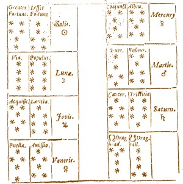

# Fortunes: Geomancy

## Based on Cornelius Agrippa's "De Occulta Philosophia" (1533)

The fortunes random quotes are often used in UNIX / Linux systems for random quotes. But a connection to the art of fortune telling as taugt by the hermetic philosophers were never made.

The origin of the geomantic figures are unknown. We know that geomanct was known by renaissance magi. Geomantic fortune symbols are described by Agrippa von Nettesheim in the chapter: *"De Geomantia, Hydromantia, Acromantia, Pyromantiaquatuor elementorum diuinationibus" (Cap. LV"* in "De Occulta Philosophia" (1531 - 1533) and in the illustrations of this work.

The geomantic figures were used by the adepti of the *Hermetic Order of the Golden Dawn* (est. ca. 1888). Aleister Crowley (1874 - 1947) used geomancy on a regular basis, which is evident in his diaries.

Per Thykjaer Jensen
Die Solis 20220313

## How to create your own fortune files

In your favorite editor just collect some sentences, and divide them by a %-character. Do it something along these lines:

~~~~
"Do what thou willt shall be the whole of the Law."
   - Aleister Crowley (1875 - 1947)
%
"Nothing beats two guitars, bass and drums."
   - Lou Reed (1942 - 2013)
~~~~

## Install

### Install fortune

If you don't have fortune, you'll have to install the program first. 

### Linux

Copy the geomancy and geomancy.dat files to `/usr/share/games/fortune`. Then run:

`fortune geomancy` in a terminal. 

### Mac

Save the two files here:

~~~~~
/opt/homebrew/opt/fortune/share/games/fortune
~~~~~

### Mac and Linux: Create the *.dat file

Here you must create a new .dat file. Do it like this:

~~~~~
rm geomancy.dat
strfile -c % geomancy geomancy.dat
~~~~~

This will create a .dat for Mac. Now copy the files to the fortune folder. If fortune is installed via Homebrew the file is somewhere around here: